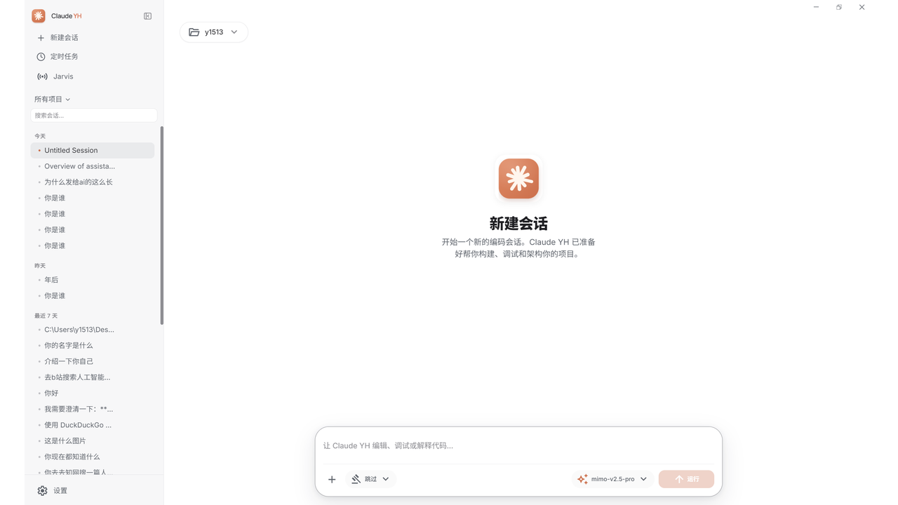
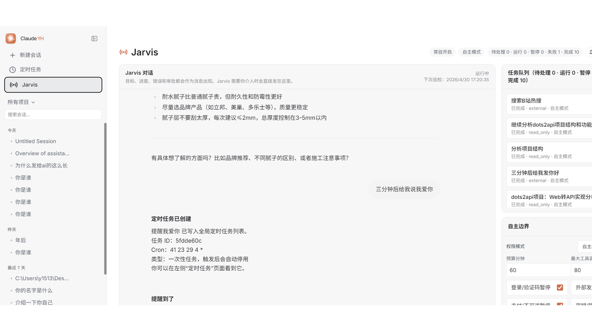
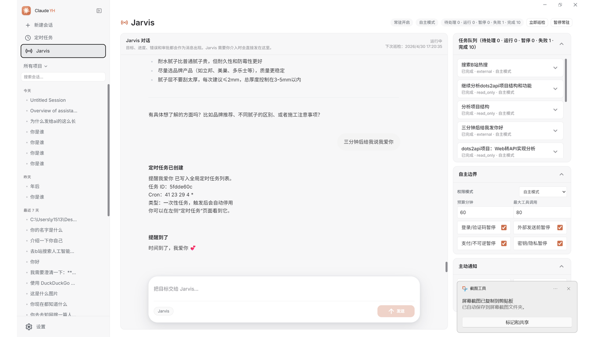
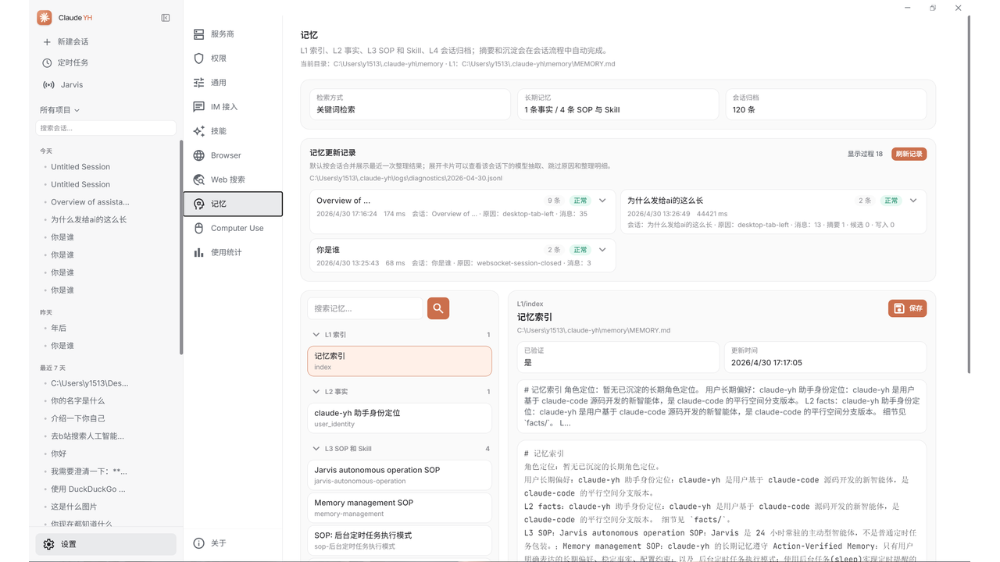
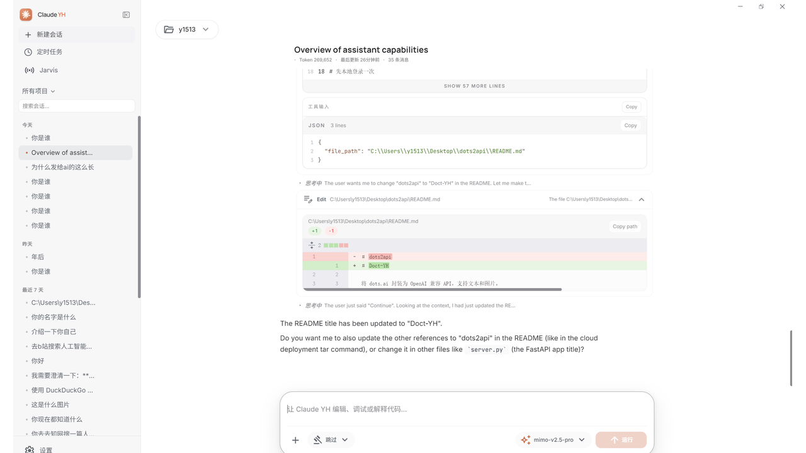

<p align="center">
  
  <br>
  <strong><span style="font-size: 1.55em;">Claude-YH</span></strong>
</p>

`claude-yh` 是一个面向中文和第三方模型场景的本地智能体工作台，提供 CLI、Web 开发界面和 Windows 桌面端。它在原有 Claude Code 工作流基础上加入 Jarvis 常驻智能体、L1-L4 长期记忆、BrowserControl、Web 搜索配置、Rust Runtime 和 IM 接入等能力。

<p align="center">
  <a href="docs/guide/quick-start.md">快速开始</a> ·
  <a href="docs/guide/env-vars.md">配置说明</a> ·
  <a href="docs/guide/third-party-models.md">第三方模型</a> ·
  <a href="docs/features/jarvis.md">Jarvis</a> ·
  <a href="docs/features/browser-control.md">BrowserControl</a> ·
  <a href="docs/memory/index.md">记忆系统</a> ·
  <a href="docs/reference/rust-runtime.md">Rust Runtime</a> ·
  <a href="docs/desktop/index.md">桌面端</a>
</p>

---

## ✨ 主要能力

- **CLI**：通过 `claude-yh` 启动交互式 TUI，也支持 `-p` 无头模式。
- **Windows 桌面端**：Tauri + React 桌面应用，集成会话、设置、记忆、Jarvis、定时任务、BrowserControl 和 IM 配置。
- **Web 开发界面**：复用桌面前端和同一后端，方便本地调试。
- **第三方模型**：支持 OpenAI Chat / OpenAI Responses / Anthropic 兼容接口，适配 MiniMax、DeepSeek、MiMo、OpenRouter、本地代理等。
- **Jarvis**：常驻型主动智能体，以对话方式接收目标，调度 Manager CLI，记录进度，处理提醒、后台任务和跨端消息。
- **长期记忆**：保留原有记忆机制，并增强为 L1-L4：L1 压缩索引、L2 长期事实、L3 SOP/Skill、L4 会话归档。
- **BrowserControl**：通过当前 Chrome 会话和 TMWD CDP Bridge 使用登录态、标签页、DOM、截图、控制台和网络信息。
- **Rust Runtime**：以 sidecar 形式提供命令安全策略、文件安全边界、grep/glob、会话索引和 Jarvis 队列恢复能力，TypeScript 业务层兜底。
- **IM 接入**：支持 Telegram、飞书等适配器，统一进入 claude-yh/Jarvis 会话。

## 界面预览

<table>
  <tr>
    <td width="50%" align="center"></td>
    <td width="50%" align="center"></td>
  </tr>
  <tr>
    <td width="50%" align="center"></td>
    <td width="50%" align="center"></td>
  </tr>
  <tr>
    <td width="50%" align="center"></td>
    <td width="50%" align="center"></td>
  </tr>
</table>

## 快速开始

### Windows 桌面端

桌面端安装包会发布到 GitHub Releases：

```text
https://github.com/ApolloYH/cc-yh/releases
```

下载最新的 `Claude YH_x64-setup.exe` 后安装即可。桌面端和 CLI 共用：

```text
%USERPROFILE%\.claude-yh\settings.json
```

本地重新打包 Windows 桌面端：

```powershell
cd desktop
bun run build:windows-x64
```

产物输出到：

```text
Releases/
```

### CLI

从 npm 安装 CLI：

```powershell
npm install -g claude-yh
claude-yh
```

从源码运行：

```powershell
bun install
bun run claude-yh
```

打包 npm CLI 包：

```powershell
npm run pack:cli
```

临时指定 env 文件：

```powershell
claude-yh --env-file C:\path\to\custom.env
```

> 打包不会包含你的 `.env`、`~/.claude-yh/settings.json` 或模型密钥。API Key 只应保存在本机配置中。

### Web 开发界面

```powershell
# 终端 1：启动后端
bun run src/server/index.ts

# 终端 2：启动前端
cd desktop
bun install
bun run dev --host 127.0.0.1 --port 2024
```

浏览器打开：

```text
http://127.0.0.1:2024
```

## 配置目录

所有端共用同一套配置和数据：

```text
~/.claude-yh/
  settings.json
  memory/
  skills/
  logs/
  projects/
```

常见配置包括：

- 模型提供商、Base URL、API Key、模型 ID
- Web 搜索端点
- BrowserControl 后端和 TMWD Bridge
- Jarvis 权限模式、常驻、队列和通知策略
- 记忆自动抽取、L1-L4 存储和日志

## 项目结构

```text
src/          CLI、核心工具、服务端、Jarvis、Memory、BrowserControl
desktop/      Windows 桌面端和 Web 开发界面
rust/         claude-yh-runtime sidecar 源码
runtime/      Computer Use Python helper
stubs/        本地类型 / 模块 stub
extensions/   Chrome/TMWD 扩展
docs/         VitePress 文档
bin/          npm/CLI 入口
Releases/     本地打包产物
```

## 🙏 来源与致谢

`claude-yh` 延续 Claude Code 的工作流和原始实现继续开发，并参考原作者 [NanmiCoder/cc-haha](https://github.com/NanmiCoder/cc-haha) 的开源工作。感谢 Anthropic Claude Code 团队以及社区对 Claude Code 生态、恢复工程和插件体系的研究。

本仓库基于 2026-03-31 从 Anthropic npm registry 泄露的 Claude Code 源码。所有原始源码版权归 Anthropic 所有。仅供学习和研究用途。

本项目在此基础上增加了第三方模型适配、中文化、Jarvis、BrowserControl、L1-L4 记忆、Rust Runtime、Windows 桌面端和 IM 适配等能力。原始 Claude Code 相关版权归 Anthropic 及其权利人所有；本项目仅作为独立开源改造与学习研究使用。

## 许可证

MIT 详见 [LICENSE](LICENSE)。
