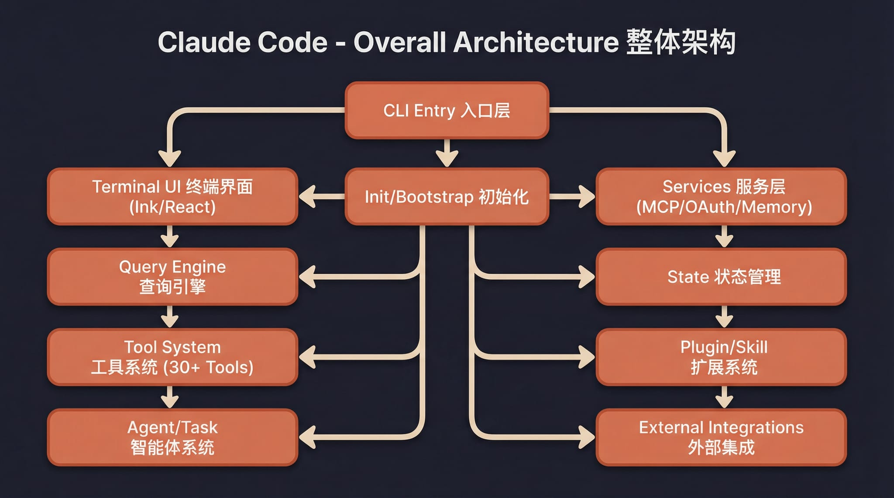
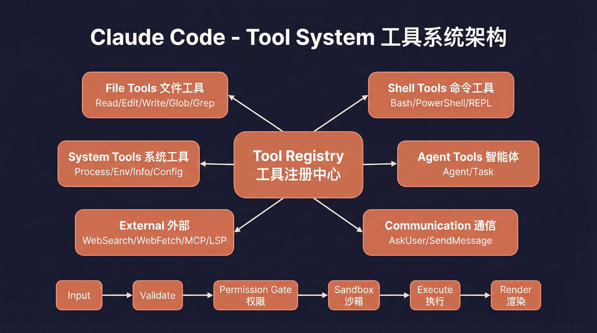
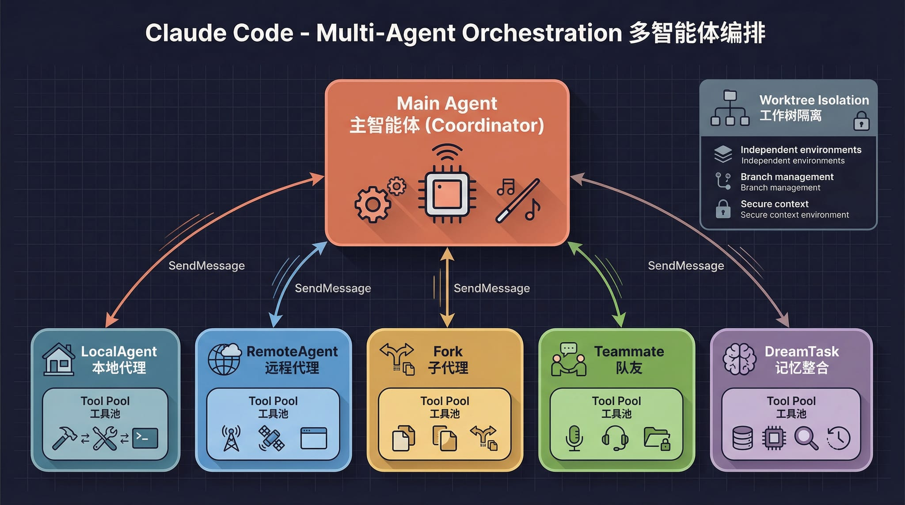
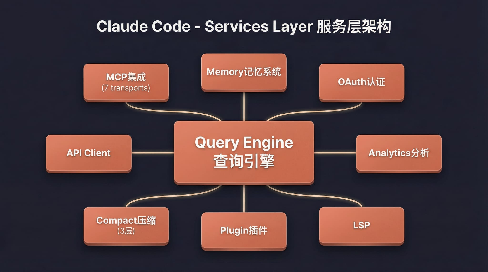
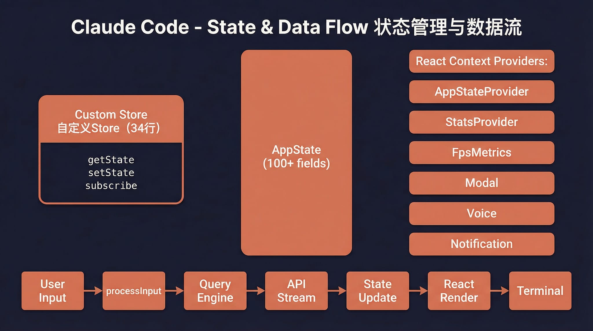
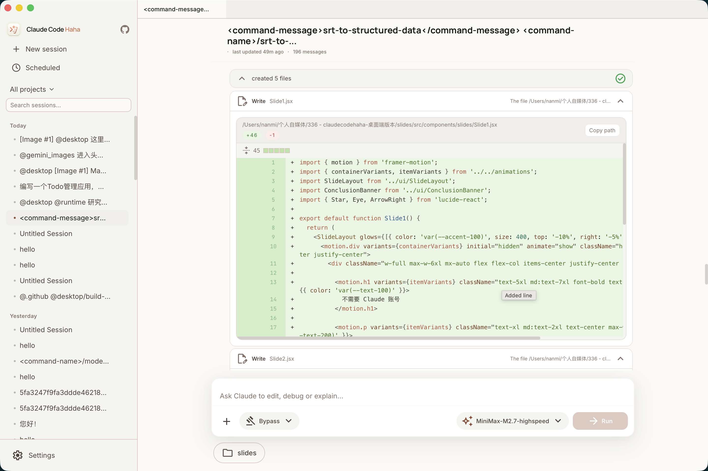
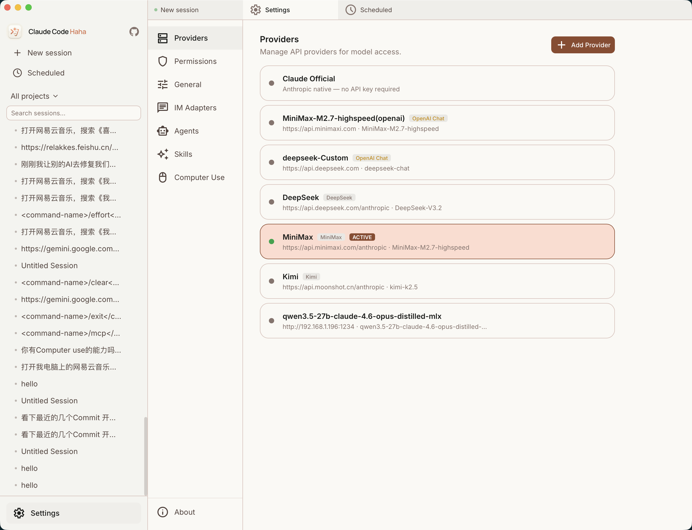
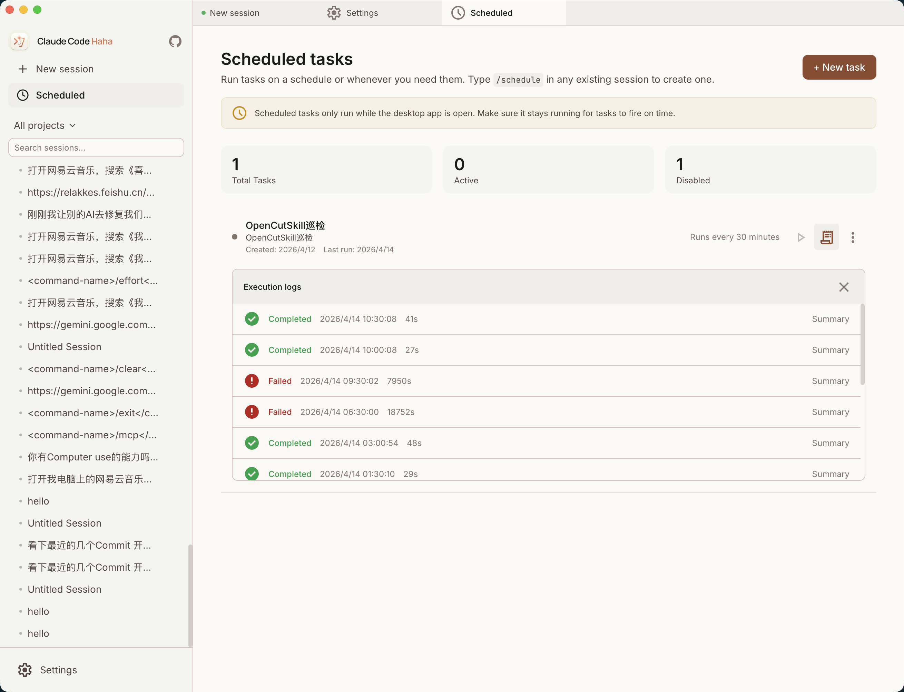
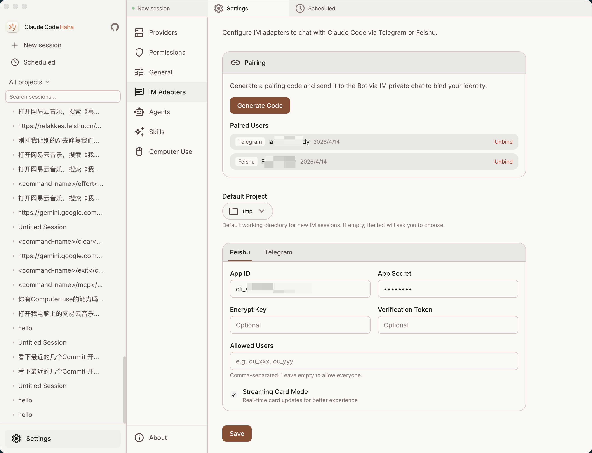

# Claude YH


基于 Claude Code 泄露源码修复的**本地可运行版本**，支持接入任意 Anthropic 兼容 API（MiniMax、OpenRouter 等）。在完整 TUI 之外，还补全了 Computer Use（macOS / Windows）、打造了图形化**桌面端**，并支持通过 Telegram / 飞书**完整远程驱动**。

<p align="center">
  <a href="#功能">功能</a> · <a href="#桌面端预览">桌面端</a> · <a href="#架构概览">架构概览</a> · <a href="#快速开始">快速开始</a> · <a href="docs/guide/env-vars.md">环境变量</a> · <a href="docs/guide/faq.md">FAQ</a> · <a href="docs/guide/global-usage.md">全局使用</a> · <a href="#更多文档">更多文档</a>
</p>

---

## OpenAI 兼容接口说明

现在接入 OpenAI 兼容模型不再必须依赖 LiteLLM。

如果上游提供的是真正 OpenAI 兼容 HTTP API，通常可以直接在 `Settings -> Providers` 里配置：

- `API Format`: `OpenAI Chat` 或 `OpenAI Responses`
- `Base URL`: 例如 `https://api.openai.com/v1`
- `API Key`: 标准 Bearer API key
- `Model`: 上游模型 ID

大多数真正实现了 `/v1/chat/completions` 或 `/v1/responses` 的 OpenAI 兼容接口都可以直接使用。LiteLLM 现在是可选项，主要用于路由、回退、统一治理，或者补某些兼容性不够的上游。

网页登录 cookie、session token、ChatGPT 网页登录态这类不属于这里支持的 API 凭证。详细说明见 [第三方模型指南](docs/guide/third-party-models.md)。

---

## 功能

- 完整的 Ink TUI 交互界面（与官方 Claude Code 一致）
- `--print` 无头模式（脚本/CI 场景）
- 支持 MCP 服务器、插件、Skills
- 支持自定义 API 端点和模型（[第三方模型使用指南](docs/guide/third-party-models.md)）
- **记忆系统**（跨会话持久化记忆）— [使用指南](docs/memory/01-usage-guide.md)
- **多 Agent 系统**（多代理编排、并行任务、Teams 协作）— [使用指南](docs/agent/01-usage-guide.md) | [实现原理](docs/agent/02-implementation.md)
- **Skills 系统**（可扩展能力插件、自定义工作流）— [使用指南](docs/skills/01-usage-guide.md) | [实现原理](docs/skills/02-implementation.md)
- **Channel 系统**（通过 Telegram/飞书/Discord 等 IM 远程控制 Agent）— [架构解析](docs/channel/01-channel-system.md)
- **Computer Use 桌面控制** — [功能指南](docs/features/computer-use.md) | [架构解析](docs/features/computer-use-architecture.md)
- **桌面端**（Tauri 2 + React 图形化客户端，多标签多会话）— [文档](docs/desktop/)
- 降级 Recovery CLI 模式（`CLAUDE_CODE_FORCE_RECOVERY_CLI=1 ./bin/claude-yh`）

---

## 架构概览

<table>
  <tr>
    <td align="center" width="25%"><br><b>整体架构</b></td>
    <td align="center" width="25%"><br><b>请求生命周期</b></td>
    <td align="center" width="25%"><br><b>工具系统</b></td>
    <td align="center" width="25%"><br><b>多 Agent 架构</b></td>
  </tr>
  <tr>
    <td align="center" width="25%"><br><b>终端 UI</b></td>
    <td align="center" width="25%"><br><b>权限与安全</b></td>
    <td align="center" width="25%"><br><b>服务层</b></td>
    <td align="center" width="25%"><br><b>状态与数据流</b></td>
  </tr>
</table>

---

## 桌面端预览

<p align="center">
  <a href="https://github.com/NanmiCoder/claude-yh/releases"></a>
   
  <a href="docs/desktop/04-installation.md"></a>
</p>

<table>
  <tr>
    <td align="center" width="33%"><br><b>主界面</b></td>
    <td align="center" width="33%"><br><b>代码编辑 & Diff 视图</b></td>
    <td align="center" width="33%"><br><b>权限控制 & AI 提问</b></td>
  </tr>
  <tr>
    <td align="center" width="33%"><br><b>多提供商管理</b></td>
    <td align="center" width="33%"><br><b>定时任务</b></td>
    <td align="center" width="33%"><br><b>IM 适配器（Telegram / 飞书）</b></td>
  </tr>
</table>

---

## 快速开始

### 1. 安装 Bun

```bash
# macOS / Linux
curl -fsSL https://bun.sh/install | bash

# macOS (Homebrew)
brew install bun

# Windows (PowerShell)
powershell -c "irm bun.sh/install.ps1 | iex"
```

> 精简版 Linux 如提示 `unzip is required`，先运行 `apt update && apt install -y unzip`

### 2. 安装依赖并配置

```bash
bun install
cp .env.example .env
# 编辑 .env 填入你的 API Key，详见 docs/guide/env-vars.md
```

### 3. 启动

#### macOS / Linux

```bash
./bin/claude-yh                          # 交互 TUI 模式
./bin/claude-yh -p "your prompt here"    # 无头模式
./bin/claude-yh --help                   # 查看所有选项
```

#### Windows

> **前置要求**：必须安装 [Git for Windows](https://git-scm.com/download/win)

```powershell
# PowerShell / cmd 直接调用 Bun
bun --env-file=.env ./src/entrypoints/cli.tsx

# 或在 Git Bash 中运行
./bin/claude-yh
```

### 4. 全局使用（可选）

将 `bin/` 加入 PATH 后可在任意目录启动，详见 [全局使用指南](docs/guide/global-usage.md)：

```bash
export PATH="$HOME/path/to/claude-yh/bin:$PATH"
```

### 5. Web 端和桌面端启动

`cc-yh` 有两种图形界面启动方式：

- **Web 开发模式**：浏览器打开 React 前端，适合调试 UI。
- **桌面壳 / Tauri 模式**：启动真正的桌面应用窗口，适合测试目录选择、系统弹窗、sidecar、桌面图标等能力。

两种方式都建议先在项目根目录安装依赖，并准备好 `.env`：

```powershell
cd C:\Users\y1513\Desktop\cc\cc-yh
bun install
```

#### 5.1 启动后端服务

Web 模式需要单独启动后端。Tauri 模式通常会通过 sidecar 拉起后端，但开发排障时也可以手动先启动根目录后端。

```powershell
cd C:\Users\y1513\Desktop\cc\cc-yh
bun --env-file=.env run src/server/index.ts
```

后端默认监听：

```text
http://127.0.0.1:3456
```

可选自检：

```powershell
Invoke-RestMethod http://127.0.0.1:3456/health
```

如果提示 `EADDRINUSE`，说明 `3456` 已经被旧进程占用。Windows 下可以这样查并停止：

```powershell
Get-NetTCPConnection -LocalPort 3456 -State Listen | Select-Object LocalAddress,LocalPort,State,OwningProcess
Stop-Process -Id <PID> -Force
```

macOS / Linux 可用：

```bash
lsof -nP -iTCP:3456 -sTCP:LISTEN
kill <PID>
```

#### 5.2 启动 Web 前端

另开一个终端：

```powershell
cd C:\Users\y1513\Desktop\cc\cc-yh\desktop
bun install
bun run dev --host 127.0.0.1 --port 2024
```

然后在浏览器打开：

```text
http://127.0.0.1:2024
```

Web 前端只负责页面展示和交互，真实会话、模型调用、文件浏览、Skills 管理、IM 适配器等能力仍然走 `3456` 后端。

#### 5.3 启动桌面壳 / Tauri

桌面壳需要本机有 Rust / Cargo。Windows 上如果还没安装，可以先安装 Rust：

```powershell
winget install Rustlang.Rustup
```

如果下载依赖较慢，可以在启动前设置代理：

```powershell
$env:HTTP_PROXY  = "http://127.0.0.1:7897"
$env:HTTPS_PROXY = "http://127.0.0.1:7897"
$env:ALL_PROXY   = "http://127.0.0.1:7897"
$env:NO_PROXY    = "localhost,127.0.0.1"
```

启动桌面壳：

```powershell
cd C:\Users\y1513\Desktop\cc\cc-yh\desktop
$env:PATH = "$env:USERPROFILE\.cargo\bin;$env:PATH"
bun run tauri dev
```

`tauri dev` 会先执行 `bun run build:sidecars && bun run dev`，再打开 `Claude YH` 桌面窗口。开发模式前端地址通常是：

```text
http://localhost:1420
```

#### 5.4 常见注意事项

- 修改根目录 `.env` 后，建议重启后端或 Tauri 桌面壳。
- 如果桌面端模型没有读取 `.env`，先确认是从项目根目录的 `.env` 启动，或者重启 `tauri dev`。
- 测试聊天时建议新建一个 session，并选择一个真实存在的工作目录。
- 如果某个旧 session 绑定的目录已被删除，服务端会返回 `Working directory does not exist`，这和服务端是否启动是两回事。

---

## 技术栈

| 类别     | 技术                                           |
| -------- | ---------------------------------------------- |
| 运行时   | [Bun](https://bun.sh)                             |
| 语言     | TypeScript                                     |
| 终端 UI  | React +[Ink](https://github.com/vadimdemedes/ink) |
| CLI 解析 | Commander.js                                   |
| API      | Anthropic SDK                                  |
| 协议     | MCP, LSP                                       |

---

## 更多文档

| 文档                                           | 说明                                                                                                                                                           |
| ---------------------------------------------- | -------------------------------------------------------------------------------------------------------------------------------------------------------------- |
| [环境变量](docs/guide/env-vars.md)                | 完整环境变量参考和配置方式                                                                                                                                     |
| [第三方模型](docs/guide/third-party-models.md)    | 接入 OpenAI / DeepSeek / Ollama 等非 Anthropic 模型                                                                                                            |
| [记忆系统](docs/memory/01-usage-guide.md)         | 跨会话持久化记忆的使用与实现                                                                                                                                   |
| [多 Agent 系统](docs/agent/01-usage-guide.md)     | 多代理编排、并行任务执行与 Teams 协作                                                                                                                          |
| [Skills 系统](docs/skills/01-usage-guide.md)      | 可扩展能力插件、自定义工作流与条件激活                                                                                                                         |
| [Channel 系统](docs/channel/01-channel-system.md) | 通过 Telegram/飞书/Discord 等 IM 平台远程控制 Agent                                                                                                            |
| [Computer Use](docs/features/computer-use.md)     | 桌面控制功能（截屏、鼠标、键盘）—[架构解析](docs/features/computer-use-architecture.md)                                                                          |
| [桌面端](docs/desktop/)                           | Tauri 2 + React 图形化客户端 —[快速上手](docs/desktop/01-quick-start.md) \| [架构设计](docs/desktop/02-architecture.md) \| [安装指南](docs/desktop/04-installation.md) |
| [全局使用](docs/guide/global-usage.md)            | 在任意目录启动 claude-yh                                                                                                                                       |
| [常见问题](docs/guide/faq.md)                     | 常见错误排查                                                                                                                                                   |
| [源码修复记录](docs/reference/fixes.md)           | 相对于原始泄露源码的修复内容                                                                                                                                   |
| [项目结构](docs/reference/project-structure.md)   | 代码目录结构说明                                                                                                                                               |

---
